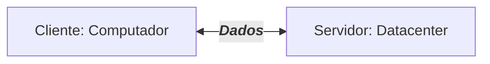
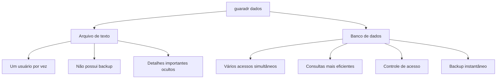
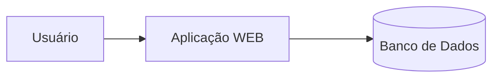

## Servidor de Desenvolvimento
Será uma interface de desenvolvimento, utilizada para projetar aplicações e banco de dados.


---
## Servidor de Arquivos Educacional
É um servidor para armazenar arquivos e facilitar na hora de realizar a transferência.

>O endereço para acesso ao servidror de arquivos é: `\\10.87.36.10`.

>Credenciais de acesso: `Senha: aluno`. `Login: aluno`.
---
## Servidor Pessoal
O Moba será a interface para acesso ao meu servidor de desenvolvimento.
>O acesso será realizado via SSH.
 
>IP da máquina: `192.168.10.77`. Username: `root`. Porta: `2222`.
senha #A...
---
- Para acessar usamos a senha:
>aluno01

- Para alterar a senha, utilizamos o comando:
```bash
passwd
```
- Para visualizar os recursos do meu servidor foi utilizado o comando:
```bash
htop
```
---
|Recurso| Configuração|
|----|-------|
|Processador|2 cores|
|RAM|512MB|
|Armazenamento|6 GB|
|Sistema Operacional| Ubuntu 26.04 LTS|
---
A utilização de um servidpr de desenvolvimento, simula um ambienre real de produção.
Os objetivos esperados são:
- Deploy de projetos;
- Aplicação de banco e dados;
- Experiência real de merado.

## Banco de Dados
Antigamente, os dados eram salvos em arquivos/planilhas.


---
>Mas afinal, onde entra o banco de dados em aplicações WEB?🤔

---
## SGBD
Sistema Gerenciador de Bancos de Dados.

>Função: Gerenciar, controlar e permitir consultas nos nossos bancos de dados.

```mermaid
graph TD
A[SGBD - PostgreSQL] -->B[(Bancos de Dados)]
A--> C[Armazena usuários]
A--> D[Realiza consulta]
A--> E[Controla acessos]