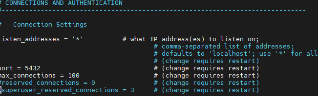
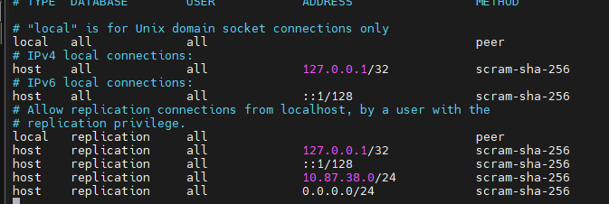

### CONFIGURAÇÕES SGBD
SGBD: Sistema Gerenciador de Banco de Dados
PAra instalação, utilizamos o comando:

```bash
sudo apt install -y postgresql
```

>No meu servidor, como eu ja estava como root, não foi necessário o sudo.

Para acesso inicial, utilizamos o comando:

```bash
sudo -u postgres psql 
```
-> socket local -- o linux liberou o seu acesso.
> Autenticação via Linux, não necessita de senha, pois você já está autenticado.

#### Após primeiro acesso, alteramos a senha, através do comando:
```sql
ALTER USER postgres PASSWORD '---';
``` 
>SQL: Comando em sql sempre em letras maiúsculas.

Para sair do SGBD, utilizamos o comando: `\q`
>comando famoso \quit em games

Para acesso externo, utilizamos o comando: 
```bash
sudo psql -h 127.0.0.1 postgres
```
> Aqui ele vai necessitar de senha!

#### Aletrações nos arquivos:
1. Navegamos até o caminho:
```bash
cd /etc/postgresql/18/main
```
2. Editamos o arquivo postgresql.conf através do comando:
```bash
sudo nano postgersql.conf
```
Linha listen_adresses = '*'
>Para pesquisar a linha: 'CTRL+W'



3. Segunda alteração no arquivo pg_hba.conf:
```bash
sudo nano pg_hba.conf
```
4. Alterações realizadas:


> Adicionamos duas linhas: 
1. 10.87.38.0/24 ; é o IP da máquina, note que o último número é um 0, um número neutro, para qualquer pc dentro de "10.87.38" possa acessar ao meu banco de dados. 
2. 0.0.0.0/24 ; novamente, 0 como um número neutro, dessa vez para que qualaquer um, do mundo todo possa acessar.

/24 é para liberar todas as faixas de IP para acesso externo.

#### 1º Comando SQL:
```sql
CREATE DATABASE cidades;
``` 
`\l` = lista todos os bancos de dados

--- 

```bash
sudo systemctl restart postgresql
```
-> Restarta a aplicação.
```bash
sudo  systemctl status postgresql
```
-> Verifica o status da aplicação.

```bash
pg_lsclusters
```
`Porta padrão: 5432`